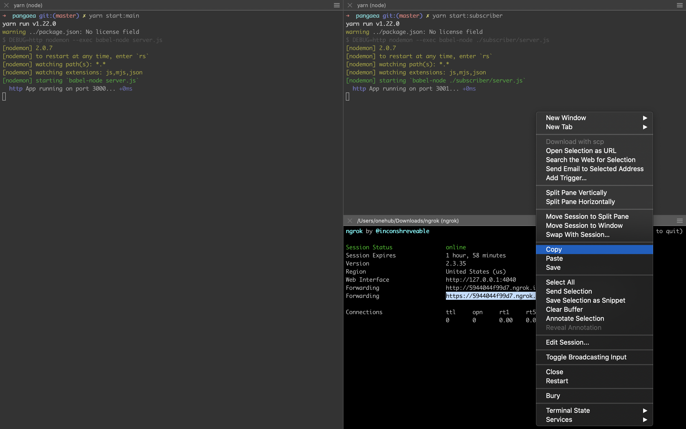
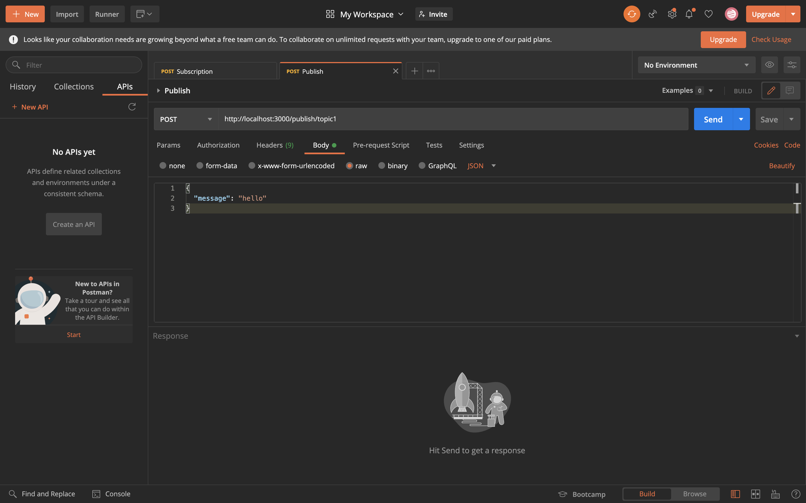
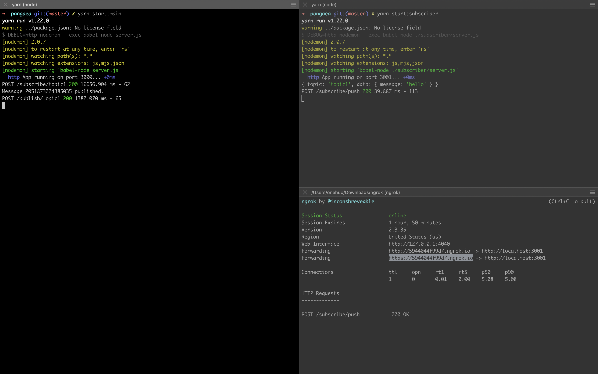

# Pangaea HTTP Notification service
An HTTP notification system. A server (or set of servers) will keep track of topics -> subscribers where a topic is a string and a subscriber is an HTTP endpoint. When a message is published on a topic, it should be forwarded to all subscriber endpoints.
You may use any frameworks or tools to accomplish this task

### Technologies
* Node.js
* Express.js
* Google Cloud PubSub

## Installation
 > Unzip the project folder

 > CD into the project directory

 > $ run `yarn`

 > Create a google cloud project and download it's service account json file to the root of the project

 > Rename the `.env.sample` to `config.env`

 > Update `GOOGLE_APPLICATION_CREDENTIALS` key in the `config.env` to the service account json filename

## To start Project
 > $ run `npm start:main` to start the publisher server

 > $ run `npm start:subscriber` to start the subscriber server

 > Provision public URLs for the localhost subscriber server using ngrok `ngrok http 3001` 


## How to use
1. To create subscription
> POST `http://127.0.0.1/subscribe/topic1`
```
Request body
{
  "url": `{NGROK_HTTPS_URL}/test1`
}

Expected response
{
  "url": "https://5944044f99d7.ngrok.io/test1",
  "topic": "topic1"
}

Side effects:
The system create a dynamic topic and subscription
```

2. To publish
> POST `http://127.0.0.1/publish/topic1`
```
Request body
{
  "message": "hello",
}

Expected response
{
  "message": "Message 2042807045304369 published :)",
  "status": true
}

Side effects:
The system emit an event and push to all the subscribing http services
```

### Demo
> Start the server by running `docker-compose build` and `docker-compose up` 

> Change `{NGROK_HTTPS_URL}` in the `demo.sh` appropriately

> Run the demo script: `./demo.sh`

## Features
 > Create a subscription 

 > Publish message to topic

## API Routes
 > POST /subscribe/{topic} - Create a subscription

 > POST /publish/{topic} - Publish message to topic

 ## Project References
 * [Express.js](https://expressjs.com)
 * [Node.js](https://nodejs.org/en/docs)
 * [ESLint](https://eslint.org/)
 * [Google Cloud Pub/Sub](https://cloud.google.com/pubsub)
## Documentation
 > [Postman collection](https://documenter.getpostman.com/view/10883636/TWDXnGig)

## Author

> ##### ROPO JOHN OLATUJOYE 
> * [LinkedIn](https://www.linkedin.com/in/ropo)

> * [Twitter](https://twitter.com/iamfiropo)






